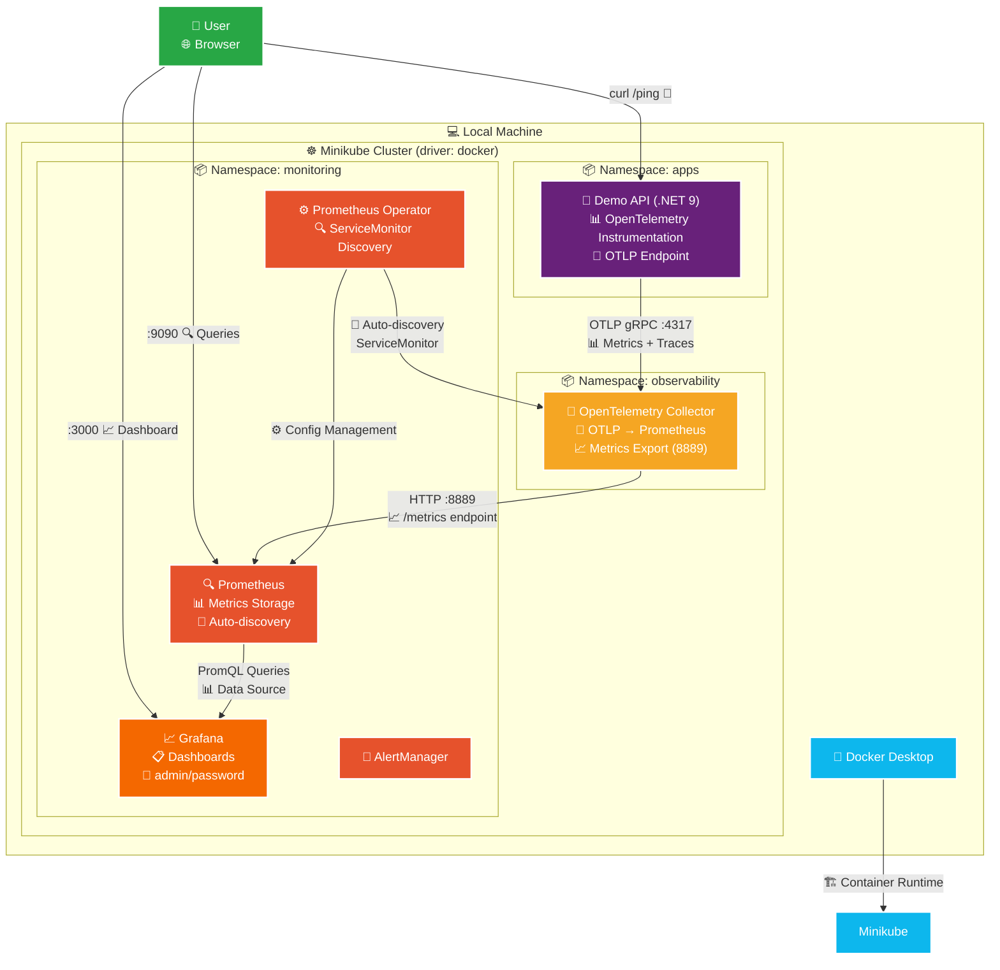
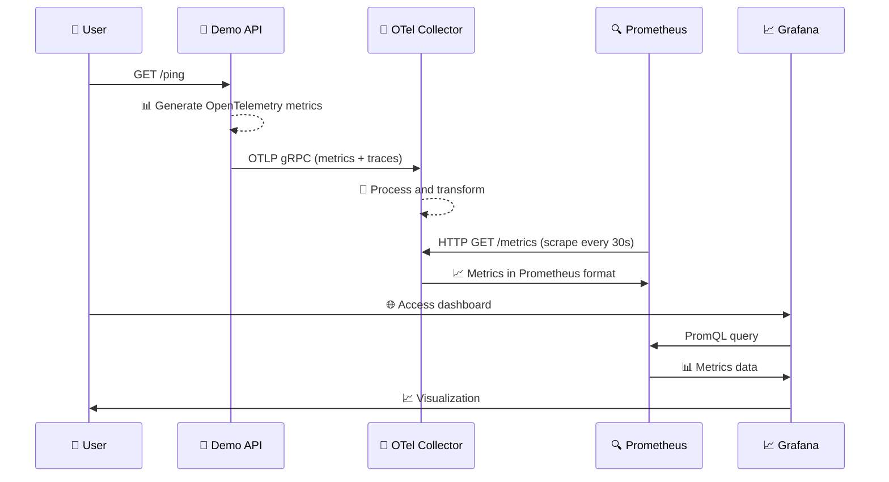
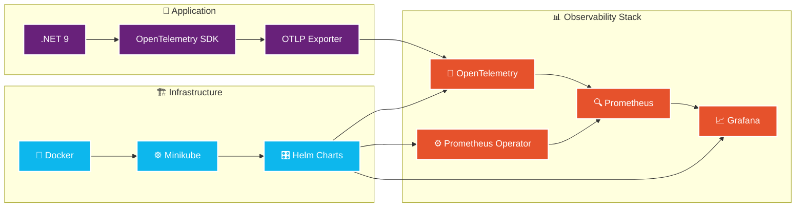

# 🔍 Workshop: Local Observability - From Zero to Hero

## 💡 Why Observability?

In the modern world of microservices and distributed applications, **it's not enough to know that something broke**. We need to know:
- 🔍 **What exactly broke?**
- ⏱️ **When did the problem start?** 
- 🎯 **Where is the bottleneck?**
- 📊 **How does it affect users?**

Observability gives us **complete visibility** into the internal behavior of our applications through **metrics**, **logs**, and **traces**.

## 🚀 Hands-on: Complete Stack in 30 minutes

In this workshop we'll build **from scratch** a complete observability stack:

```
🏗️ Stack: Minikube + OpenTelemetry + Prometheus + Grafana + .NET 9
🎯 Goal: Monitor a real API with real-time metrics
⏱️ Time: ~30 minutes  
🌐 Scope: 100% local, no external dependencies
```

**What you'll learn:**
- ✅ Configure OpenTelemetry in .NET 9
- ✅ Deploy Prometheus + Grafana with Helm
- ✅ Create OTLP → Collector → Prometheus metrics pipelines
- ✅ Visualize real metrics from your application
- ✅ Configuration troubleshooting

---

## 🎬 Start Now!

👉 **[Go to Complete Workshop →](./setup.md)**

---

## 🏗️ Stack Architecture

### Visual Flow Diagram



## 📋 Components and Ports

| Component | Namespace | Port | Function |
|------------|-----------|---------|---------|
| 🚀 Demo API | `apps` | `8080` | .NET application with OpenTelemetry |
| 📡 OpenTelemetry Collector | `observability` | `4317` (OTLP), `8889` (metrics) | Receives OTLP → Exposes metrics |
| 🔍 Prometheus | `monitoring` | `9090` | Stores and queries metrics |
| 📈 Grafana | `monitoring` | `3000` | Dashboards and visualization |

## 🔄 Data Flow



## 🎯 Key Monitored Metrics

```mermaid
graph TD
    Root["📊 Key Metrics"]
    
    Root --> TargetInfo["🎯 Target Info"]
    Root --> HTTPReq["🌐 HTTP Requests"] 
    Root --> Runtime["🔧 .NET Runtime"]
    Root --> Collector["⚙️ Collector Status"]
    
    TargetInfo --> T1["deployment_environment"]
    TargetInfo --> T2["telemetry_sdk_name"]
    TargetInfo --> T3["exported_job"]
    
    HTTPReq --> H1["aspnetcore_routing_match_attempts_total"]
    HTTPReq --> H2["http_server_request_duration_seconds"]
    HTTPReq --> H3["http_client_active_requests"]
    
    Runtime --> R1["process_runtime_dotnet_gc_collections_total"]
    Runtime --> R2["process_runtime_dotnet_assemblies_count"]
    Runtime --> R3["kestrel_active_connections"]
    
    Collector --> C1["otel_collector_up"]
    Collector --> C2["scrape_duration_seconds"]

    %% Styles
    classDef rootNode fill:#E6522C,stroke:#ffffff,stroke-width:3px,color:#ffffff
    classDef categoryNode fill:#326CE5,stroke:#ffffff,stroke-width:2px,color:#ffffff
    classDef metricNode fill:#68217A,stroke:#ffffff,stroke-width:1px,color:#ffffff
    
    class Root rootNode
    class TargetInfo,HTTPReq,Runtime,Collector categoryNode
    class T1,T2,T3,H1,H2,H3,R1,R2,R3,C1,C2 metricNode
```



## 🚀 Technology Stack



---

> 🎉 **100% local and cloud-agnostic architecture!** 
> 
> Everything runs on your machine with Minikube + Docker, with no external dependencies or remote registries.