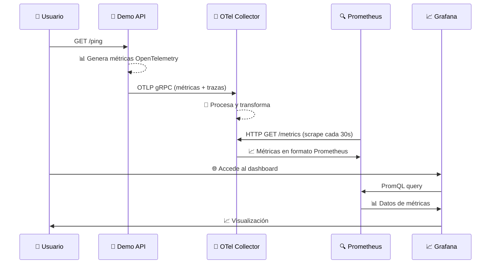
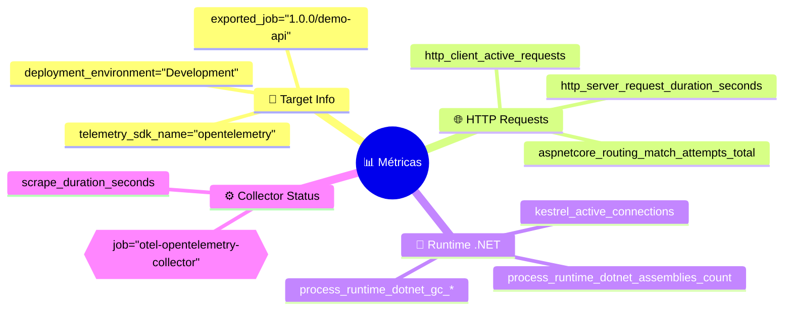
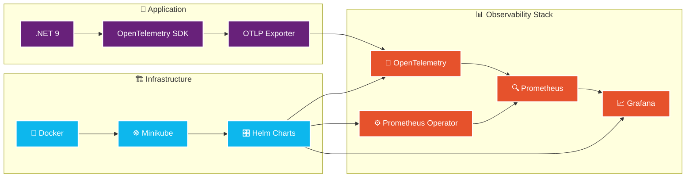

# 🔍 Workshop: Observabilidad Local - De Zero a Hero

## 💡 ¿Por qué Observabilidad?

En el mundo moderno de microservicios y aplicaciones distribuidas, **no basta con saber que algo se rompió**. Necesitamos saber:
- 🔍 **¿Qué se rompió exactamente?**
- ⏱️ **¿Cuándo empezó el problema?** 
- 🎯 **¿Dónde está el cuello de botella?**
- 📊 **¿Cómo afecta a los usuarios?**

La observabilidad nos da **visibilidad total** del comportamiento interno de nuestras aplicaciones a través de **métricas**, **logs** y **trazas**.

## 🚀 Hands-on: Stack Completo en 30 minutos

En este workshop montaremos **desde cero** un stack completo de observabilidad:

```
🏗️ Stack: Minikube + OpenTelemetry + Prometheus + Grafana + .NET 9
🎯 Objetivo: Monitorear una API real con métricas en tiempo real
⏱️ Tiempo: ~30 minutos  
🌐 Alcance: 100% local, sin dependencias externas
```

**Lo que aprenderás:**
- ✅ Configurar OpenTelemetry en .NET 9
- ✅ Desplegar Prometheus + Grafana con Helm
- ✅ Crear pipelines de métricas OTLP → Collector → Prometheus
- ✅ Visualizar métricas reales de tu aplicación
- ✅ Troubleshooting de configuraciones

---

## 🎬 ¡Empezar Ahora!

👉 **[Ir al Workshop Completo →](./setup.md)**

---

## 🏗️ Arquitectura del Stack

### Diagrama de Flujo Visual


## 📋 Componentes y Puertos

| Componente | Namespace | Puerto | Función |
|------------|-----------|---------|---------|
| 🚀 Demo API | `apps` | `8080` | Aplicación .NET con OpenTelemetry |
| 📡 OpenTelemetry Collector | `observability` | `4317` (OTLP), `8889` (metrics) | Recibe OTLP → Expone métricas |
| 🔍 Prometheus | `monitoring` | `9090` | Almacena y consulta métricas |
| 📈 Grafana | `monitoring` | `3000` | Dashboards y visualización |

## 🔄 Flujo de Datos



## 🎯 Métricas Clave Monitoreadas



## 🚀 Stack Tecnológico



---

> 🎉 **¡Arquitectura 100% local y cloud-agnostic!** 
> 
> Todo corre en tu máquina con Minikube + Docker, sin dependencias externas ni registries remotos.