# 🔍 Workshop: Observabilidad Local - De Zero a Hero

## 💡 ¿Por qué Observabilidad?

En el mundo moderno de microservicios y aplicaciones distribuidas, **no basta con saber que algo se rompió**. Necesitamos saber:
- 🔍 **¿Qué se rompió exactamente?**
- ⏱️ **¿Cuándo empezó el problema?** 
- 🎯 **¿Dónde está el cuello de botella?**
- 📊 **¿Cómo afecta a los usuarios?**

La observabilidad nos da **visibilidad total** del comportamiento interno de nuestras aplicaciones a través de **métricas**, **logs** y **trazas**.

## 🚀 Hands-on: Stack Completo en 30 minutos

En este workshop montaremos **desde cero** un stack completo de observabilidad:

```
🏗️ Stack: Minikube + OpenTelemetry + Prometheus + Grafana + .NET 9
🎯 Objetivo: Monitorear una API real con métricas en tiempo real
⏱️ Tiempo: ~30 minutos  
🌐 Alcance: 100% local, sin dependencias externas
```

**Lo que aprenderás:**
- ✅ Configurar OpenTelemetry en .NET 9
- ✅ Desplegar Prometheus + Grafana con Helm
- ✅ Crear pipelines de métricas OTLP → Collector → Prometheus
- ✅ Visualizar métricas reales de tu aplicación
- ✅ Troubleshooting de configuraciones

---

## 🎬 ¡Empezar Ahora!

👉 **[Ir al Workshop Completo →](./setup.md)**

---

## 🏗️ Arquitectura del Stack

### Diagrama de Flujo Visual


## 📋 Componentes y Puertos

| Componente | Namespace | Puerto | Función |
|------------|-----------|---------|---------|
| 🚀 Demo API | `apps` | `8080` | Aplicación .NET con OpenTelemetry |
| 📡 OpenTelemetry Collector | `observability` | `4317` (OTLP), `8889` (metrics) | Recibe OTLP → Expone métricas |
| 🔍 Prometheus | `monitoring` | `9090` | Almacena y consulta métricas |
| 📈 Grafana | `monitoring` | `3000` | Dashboards y visualización |

## 🔄 Flujo de Datos

```mermaid
sequenceDiagram
    participant User as 👤 Usuario
    participant API as 🚀 Demo API
    participant OTEL as 📡 OTel Collector
    participant PROM as 🔍 Prometheus
    participant GRAF as 📈 Grafana

    User->>API: GET /ping
    API-->>API: 📊 Genera métricas OpenTelemetry
    API->>OTEL: OTLP gRPC (métricas + trazas)
    OTEL-->>OTEL: 🔄 Procesa y transforma
    PROM->>OTEL: HTTP GET /metrics (scrape cada 30s)
    OTEL->>PROM: 📈 Métricas en formato Prometheus
    User->>GRAF: 🌐 Accede al dashboard
    GRAF->>PROM: PromQL query
    PROM->>GRAF: 📊 Datos de métricas
    GRAF->>User: 📈 Visualización
```



## 🎯 Métricas Clave Monitoreadas

```mermaid
graph TD
    Root["📊 Métricas Clave"]
    
    Root --> TargetInfo["🎯 Target Info"]
    Root --> HTTPReq["🌐 HTTP Requests"] 
    Root --> Runtime["🔧 Runtime .NET"]
    Root --> Collector["⚙️ Collector Status"]
    
    TargetInfo --> T1["deployment_environment"]
    TargetInfo --> T2["telemetry_sdk_name"]
    TargetInfo --> T3["exported_job"]
    
    HTTPReq --> H1["aspnetcore_routing_match_attempts_total"]
    HTTPReq --> H2["http_server_request_duration_seconds"]
    HTTPReq --> H3["http_client_active_requests"]
    
    Runtime --> R1["process_runtime_dotnet_gc_collections_total"]
    Runtime --> R2["process_runtime_dotnet_assemblies_count"]
    Runtime --> R3["kestrel_active_connections"]
    
    Collector --> C1["otel_collector_up"]
    Collector --> C2["scrape_duration_seconds"]

    %% Estilos
    classDef rootNode fill:#E6522C,stroke:#ffffff,stroke-width:3px,color:#ffffff
    classDef categoryNode fill:#326CE5,stroke:#ffffff,stroke-width:2px,color:#ffffff
    classDef metricNode fill:#68217A,stroke:#ffffff,stroke-width:1px,color:#ffffff
    
    class Root rootNode
    class TargetInfo,HTTPReq,Runtime,Collector categoryNode
    class T1,T2,T3,H1,H2,H3,R1,R2,R3,C1,C2 metricNode
```



## 🚀 Stack Tecnológico


---

> 🎉 **¡Arquitectura 100% local y cloud-agnostic!** 
> 
> Todo corre en tu máquina con Minikube + Docker, sin dependencias externas ni registries remotos.