# 🔍 Workshop: Local Observability - From Zero to Hero

## 💡 Why Observability?

In the modern world of microservices and distributed applications, **it's not enough to know that something broke**. We need to know:
- 🔍 **What exactly broke?**
- ⏱️ **When did the problem start?** 
- 🎯 **Where is the bottleneck?**
- 📊 **How does it affect users?**

Observability gives us **complete visibility** into the internal behavior of our applications through **metrics**, **logs**, and **traces**.

## 🚀 Hands-on: Complete Stack in 30 minutes

In this workshop we'll build **from scratch** a complete observability stack:

```
🏗️ Stack: Minikube + OpenTelemetry + Prometheus + Tempo + Loki + Grafana + .NET 9
🎯 Goal: Monitor a real API with metrics, traces and logs
⏱️ Time: ~30 minutes  
🌐 Scope: 100% local, no external dependencies
```

**What you'll learn:**
- ✅ Configure OpenTelemetry in .NET 9
- ✅ Deploy Prometheus + Tempo + Loki + Grafana with Helm
- ✅ Create OTLP → Collector → Prometheus/Tempo/Loki pipelines
- ✅ Visualize metrics, traces and logs from your application
- ✅ Configuration troubleshooting

---

## 🎬 Start Now!

👉 **[Go to Complete Workshop →](./setup.md)**

---

## 🏗️ Stack Architecture

### Visual Flow Diagram

```mermaid
graph TB
    %% Node styles
    classDef k8s fill:#326CE5,stroke:#ffffff,stroke-width:2px,color:#ffffff
    classDef app fill:#68217A,stroke:#ffffff,stroke-width:2px,color:#ffffff
    classDef otel fill:#F5A623,stroke:#ffffff,stroke-width:2px,color:#ffffff
    classDef prometheus fill:#E6522C,stroke:#ffffff,stroke-width:2px,color:#ffffff
    classDef grafana fill:#F46800,stroke:#ffffff,stroke-width:2px,color:#ffffff
    classDef tempo fill:#00ADD8,stroke:#ffffff,stroke-width:2px,color:#ffffff
    classDef loki fill:#7B42BC,stroke:#ffffff,stroke-width:2px,color:#ffffff
    classDef docker fill:#0db7ed,stroke:#ffffff,stroke-width:2px,color:#ffffff
    classDef user fill:#28a745,stroke:#ffffff,stroke-width:2px,color:#ffffff

    %% Docker and Minikube
    subgraph "💻 Local Machine"
        Docker["🐳 Docker Desktop"]
        
        subgraph "☸️ Minikube Cluster (driver: docker)"
            subgraph "📦 Namespace: apps"
                DemoAPI["🚀 Demo API (.NET 9)<br/>📊 OpenTelemetry Instrumentation<br/>🔗 OTLP Endpoint"]
            end
            
            subgraph "📦 Namespace: observability"
                OTelCollector["📡 OpenTelemetry Collector<br/>🔄 OTLP → Prometheus/Tempo/Loki<br/>📈 Metrics Export (8889)"]
                Tempo["🔀 Grafana Tempo<br/>📍 Traces Storage<br/>🎯 OTLP Receiver (4317)"]
                Loki["📝 Grafana Loki<br/>📋 Logs Storage<br/>🔗 HTTP API (3100)"]
            end
            
            subgraph "📦 Namespace: monitoring"
                Prometheus["🔍 Prometheus<br/>📊 Metrics Storage<br/>🎯 Auto-discovery"]
                Grafana["📈 Grafana<br/>📋 Dashboards<br/>👤 admin/password"]
                AlertManager["🚨 AlertManager"]
                PrometheusOperator["⚙️ Prometheus Operator<br/>🔍 ServiceMonitor Discovery"]
            end
        end
    end
    
    %% User
    User["👤 User<br/>🌐 Browser"]
    
    %% Main connections
    User -->|":3000 📈 Dashboard"| Grafana
    User -->|":9090 🔍 Queries"| Prometheus
    User -->|"curl /ping 🏃"| DemoAPI
    
    %% Data flow
    DemoAPI -->|"OTLP gRPC :4317<br/>📊 Metrics + Traces + Logs"| OTelCollector
    OTelCollector -->|"HTTP :8889<br/>📈 /metrics endpoint"| Prometheus
    OTelCollector -->|"OTLP gRPC :4317<br/>📍 Traces"| Tempo
    OTelCollector -->|"HTTP :3100<br/>📋 Logs"| Loki
    Prometheus -->|"PromQL Queries<br/>📊 Data Source"| Grafana
    Tempo -->|"TraceQL Queries<br/>📍 Data Source"| Grafana
    Loki -->|"LogQL Queries<br/>📋 Data Source"| Grafana
    
    %% ServiceMonitor
    PrometheusOperator -->|"🎯 Auto-discovery<br/>ServiceMonitor"| OTelCollector
    PrometheusOperator -->|"⚙️ Config Management"| Prometheus
    
    %% Docker relationship
    Docker -->|"🏗️ Container Runtime"| Minikube
    
    %% Apply styles
    class Docker,Minikube docker
    class DemoAPI app
    class OTelCollector otel
    class Prometheus,PrometheusOperator,AlertManager prometheus
    class Grafana grafana
    class Tempo tempo
    class Loki loki
    class User user
```



## 📋 Components and Ports

| Component | Namespace | Port | Function |
|------------|-----------|---------|---------|
| 🚀 Demo API | `apps` | `8080` | .NET application with OpenTelemetry |
| 📡 OpenTelemetry Collector | `observability` | `4317` (OTLP gRPC), `4318` (OTLP HTTP), `8889` (metrics) | Receives OTLP → Exposes metrics/traces/logs |
| 🔍 Prometheus | `monitoring` | `9090` | Stores and queries metrics |
| 🔀 Grafana Tempo | `observability` | `4317` (OTLP), `3200` (HTTP) | Stores and queries traces |
| 📝 Grafana Loki | `observability` | `3100` (HTTP) | Stores and queries logs |
| 📈 Grafana | `monitoring` | `3000` | Dashboards and visualization |

## 🔄 Data Flow

```mermaid
sequenceDiagram
    participant User as 👤 User
    participant API as 🚀 Demo API
    participant OTEL as 📡 OTel Collector
    participant PROM as 🔍 Prometheus
    participant TEMPO as 🔀 Tempo
    participant LOKI as 📝 Loki
    participant GRAF as 📈 Grafana

    User->>API: GET /ping
    API-->>API: 📊 Generate OpenTelemetry signals
    API->>OTEL: OTLP gRPC (metrics + traces + logs)
    OTEL-->>OTEL: 🔄 Process and transform
    
    %% Metrics flow
    PROM->>OTEL: HTTP GET /metrics (scrape every 30s)
    OTEL->>PROM: 📈 Metrics in Prometheus format
    
    %% Traces flow
    OTEL->>TEMPO: OTLP gRPC (traces)
    TEMPO-->>TEMPO: 📍 Store traces
    
    %% Logs flow
    OTEL->>LOKI: HTTP POST /loki/api/v1/push (logs)
    LOKI-->>LOKI: 📋 Store logs
    
    %% Grafana queries
    User->>GRAF: 🌐 Access dashboard
    GRAF->>PROM: PromQL query
    PROM->>GRAF: 📊 Metrics data
    GRAF->>TEMPO: TraceQL query
    TEMPO->>GRAF: 📍 Traces data
    GRAF->>LOKI: LogQL query
    LOKI->>GRAF: 📋 Logs data
    GRAF->>User: 📈 Unified visualization
```



## 🎯 Key Monitored Metrics


## 🚀 Technology Stack

```mermaid
graph LR
    subgraph "🏗️ Infrastructure"
        A[🐳 Docker] --> B[☸️ Minikube]
        B --> C[🎛️ Helm Charts]
    end
    
    subgraph "📊 Observability Stack"
        D[📡 OpenTelemetry] --> E[🔍 Prometheus]
        D --> H[🔀 Tempo]
        D --> I[📝 Loki]
        E --> F[📈 Grafana]
        H --> F
        I --> F
        G[⚙️ Prometheus Operator] --> E
    end
    
    subgraph "🚀 Application"
        J[.NET 9] --> K[OpenTelemetry SDK]
        K --> L[OTLP Exporter]
    end
    
    C --> D
    C --> G
    C --> F
    C --> H
    C --> I
    L --> D

    %% Styles
    classDef infra fill:#0db7ed,stroke:#ffffff,stroke-width:2px,color:#ffffff
    classDef obs fill:#E6522C,stroke:#ffffff,stroke-width:2px,color:#ffffff
    classDef app fill:#68217A,stroke:#ffffff,stroke-width:2px,color:#ffffff
    classDef tempo fill:#00ADD8,stroke:#ffffff,stroke-width:2px,color:#ffffff
    classDef loki fill:#7B42BC,stroke:#ffffff,stroke-width:2px,color:#ffffff
    
    class A,B,C infra
    class D,E,F,G obs
    class J,K,L app
    class H tempo
    class I loki
```



---

> 🎉 **100% local and cloud-agnostic architecture!** 
> 
> Everything runs on your machine with Minikube + Docker, with no external dependencies or remote registries.